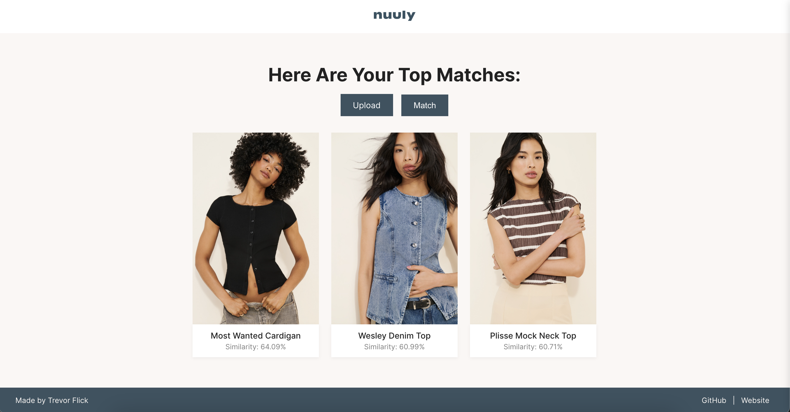

# Nuuly Lens

Nuuly Lens is a full-stack image search tool that lets users upload a photo and see the top 3 most similar Nuuly clothing items, styled like the Nuuly site itself.

Built with:
- Vue 3 + Vite (frontend)
- Express (backend)
- Replicate’s CLIP model (for image vectorization)
- GitHub Pages (for hosting product images)
- Cloudflare Worker (for image upload endpoint)

---

### Landing Page


### Match Results


## Project Setup

### 1. Clone this repo

```bash
git clone https://github.com/YOUR_USERNAME/nuuly-lens.git
cd nuuly-lens
```

---

### 2. Set up your `.env`

Create a `.env` file in the root and paste this:

```env
REPLICATE_API_TOKEN=your_token_here
```

This is used to authenticate with the Replicate API.

> You can either [generate a replicate token here](https://replicate.com/account/api-tokens)
> OR you can [email me](me@trevorflick.com) and I'll give you mine (i have enough free credits for thousands of calls (and a rate limiter))


---

### 3. Install dependencies

#### Backend (from project root):

```bash
npm install
```

#### Frontend (in a separate terminal):

```bash
cd client
npm install
```

---

## Run the project

### Step 1: Start the backend (port 5050)

```bash
npm run dev
```

### Step 2: Start the frontend (port 5173)

```bash
cd client
npm run dev
```

---

### Visit

Open [http://localhost:5173](http://localhost:5173) in your browser and:

- Upload a shirt
- Your image gets send to [this CLIP API](https://replicate.com/andreasjansson/clip-features/) where it get vectorized for comparison against the Nuuly catalog items
- Receive 3 visual matches from the Nuuly catalog
- Matches computed locally from a pre-vectorized dataset in `backend/revectorized_nuuly_data.json`

---

## Run Unit Tests

From `client/`:

```bash
npm run test
```

> Currently set up with `vitest` and `@vue/test-utils`

---

## Folder Structure

```
nuuly-lens/
├── backend/              # Express server + image handling
│   ├── server.js
│   ├── upload.js
│   └── revectorized_nuuly_data.json
│
├── client/               # Vue 3 + Vite frontend
│   ├── index.html
│   ├── package.json
│   ├── vite.config.js
│   ├── jsconfig.json
│   ├── src/
│   │   ├── App.vue
│   │   ├── main.js
│   │   ├── router.js
│   │   ├── assets/
│   │   ├── components/
│   │   └── composables/
│
├── uploads/              # Temp image storage (gitignored)
├── .env.example
├── .gitignore
├── package.json          # Backend only
└── README.md
```

---

## Built With

- [Vue 3](https://vuejs.org/)
- [Vite](https://vitejs.dev/)
- [Express](https://expressjs.com/)
- [Replicate](https://replicate.com/andreasjansson/clip-features/)
- [Cloudlfare](https://developers.cloudflare.com/workers/wrangler/)
---

## Credits

Designed & engineered by [trevor flick](https://trevorflick.com)
